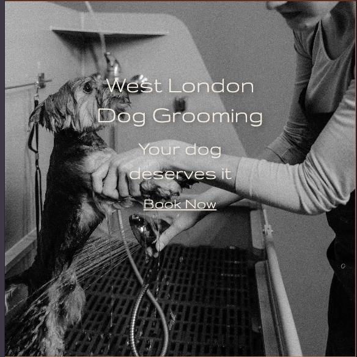
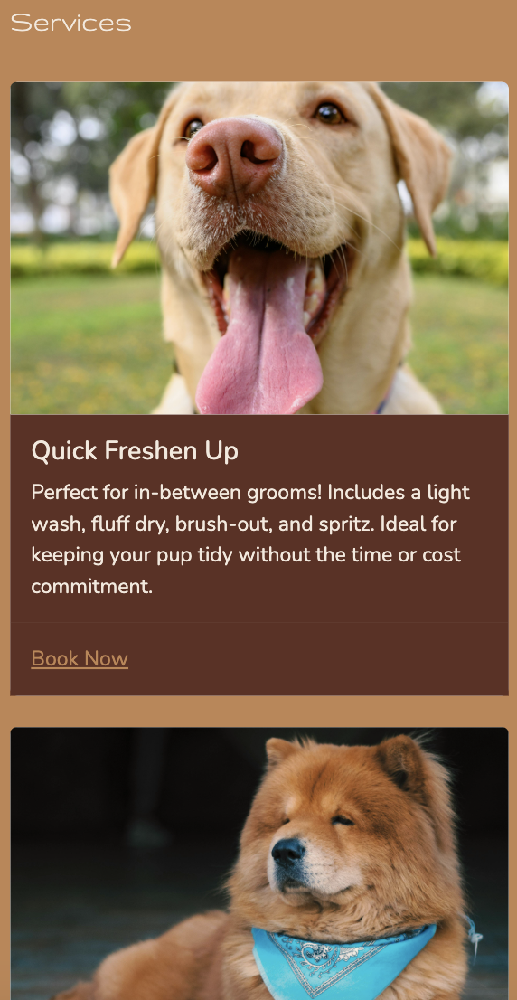
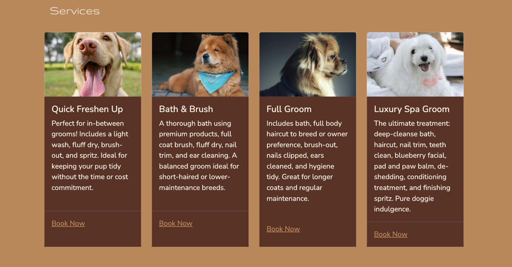

# West London Dog Grooming
Project 1 - Simon Vaz

[View live github project] +++++++++++++++++++++++++++

---

## Table of Contents

- Overview
- User Goals
- Business Goals
- Features
- Technologies Used
- Testing
- Bugs
- Future Improvements
- Deployment
- Credits

---

## Overview

West London Dog Grooming is a modern, mobile-responsive website for a professional dog grooming business located in Acton, West London. The website is designed to clearly present grooming services, opening hours, and contact information, with a built-in form to facilitate appointment bookings.

The goal is to offer pet owners a smooth and informative user experience while promoting the business's caring and high-quality approach.

---

## User Goals 

- View grooming services and pricing.
- Learn about the business and its values. 
- Contact the groomers via email or phone. 
- Book an appointment easily using the form. 
- Access the site on mobile, tablet or desktop devices. 

---

## Business Goals

- Present the business in a trustworthy and friendly light.
- Highlight services and opening hours clearly. 
- Make it easy for potential clients to get in touch. 
- Encourage appointment bookings via the contact form.
- Promote the business on social media. 

---

## Features 

The features for this website were chosen to prioritise ease of use and clarity to the user, ensuring information is presented in a concise and accessable manner to the end user. 

### Navigation Menu 

The website features a responsive fixed navigation bar for easy access to the various sections of the website. These include Home, About, Services/Prices and Contact. 
- The Logo, which I designed myself, is located on the far left of the navbar with the navicons placed in the middle of the screen on larger devices. 
- On smaller screensizes, a dropdown menu is used to save screen space and create simple navigation

### Mobile Nav Bar

### Desktop Nav Bar

### Hero Section

A hero section has been included with the intent of introducing the brand immediately. It shows the business' name followed by a slogan. It also includes a 'Book Now' button to clearly display one of the key functions of the website but also to allow regular customers easy access to the booking form thus saving time.

### Mobile Hero

### Desktop Hero

### About Section
The about section allows visitors to learn about the business by giving a brief overview of the skills and services provided.
- The section is split into two sub-sections, the first having a brief text description and the second having a carousel of dog grooming related images.
- It is hoped this section provides a stylish, boutique feel which is inline with the business' philosophy
- This section is also fully responsive. On larger screens both sub-sections appear side by side where as on smaller devices they're stacked
- The carousel has auto-slides as well as manual buttons to view the selection of images

### Mobile About Section

### Desktop About

### Services/Prices Section
The Services/Prices page is separate from the home page. It allows users to browse dog grooming packages and prices on the dedicate page. 
- Two sections are shown on this page with both containing a group of four cards. All card templates use Bootstrap 5.3.
- The first set of cards display the services the business offer. These move up from left to right from least complex to more complex service.
- The second set of cards show the price of the above services depending on the size of the dog. Again, they move from left to right from smallest to biggest.
- A button is shown on all cards which will direct users to the booking form once they have browsed the business' offerings.
- All cards are fully responsive to all screensizes as shown below

### Mobile Services Section

### Desktop Services Section

### Booking Form 
When a user selects the 'Book Now' link on either the hero image or any of the Services/Prices cards, they are taken to a booking form.
- The booking form collect the users name, contact details, pet information and their preferred service/time.
- All input fields are required to ensure all essential information is collected.
- The form style is in-keeping with the wider website style. 
